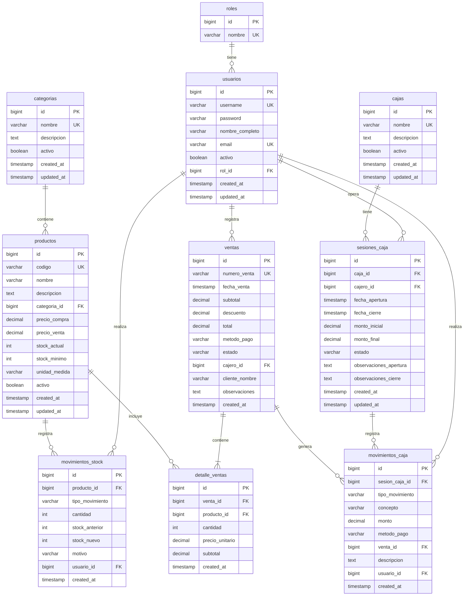

## 📊 Resumen de Entidades

### Módulo Usuarios (V1)
- **roles**: Define los roles del sistema
- **usuarios**: Información de usuarios del sistema

### Módulo Inventario (V2)
- **categorias**: Clasificación de productos
- **productos**: Catálogo de productos
- **movimientos_stock**: Historial de cambios en inventario

### Módulo Ventas (V3)
- **ventas**: Cabecera de cada venta
- **detalle_ventas**: Items vendidos en cada venta

### Módulo Cajas (V4)
- **cajas**: Cajas físicas del negocio
- **sesiones_caja**: Aperturas/cierres de caja
- **movimientos_caja**: Movimientos de dinero

## 🔐 Roles Iniciales
- **ROL_ADMIN**: Acceso total al sistema
- **ROL_ENCARGADO**: Gestión de inventario y reportes
- **ROL_CAJERO**: Ventas y operación de caja

## 📝 Notas Importantes
1. Todos los precios están en formato DECIMAL(10,2)
2. Las fechas usan TIMESTAMP para precisión
3. Se incluyen constraints para validación de datos
4. Índices agregados para optimizar consultas frecuentes
5. Claves foráneas con nombres descriptivos
